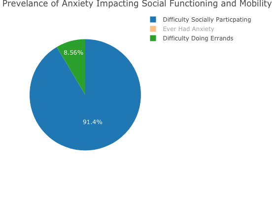
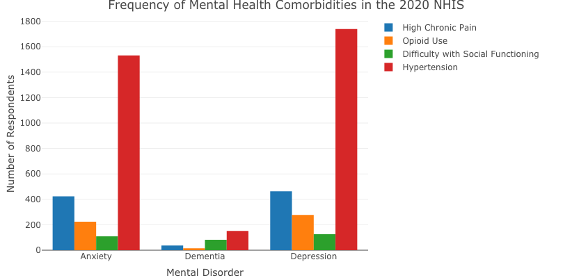

## Conclusion

Our three points of focus were the impact of anxiety, the frequency of the chosen comorbidities, and the annual prevalence of the mental health disorders.

### Anxiety

Using our pie chart, we attempted to analyze the prevalence of anxiety impacting social functioning and mobility. This pie chart was intended to show the proportion of people who reported experiencing difficulty with social mobility (difficulty running errands alone, difficulty participating in social activities) in addition to reporting experiencing anxiety. Viewers may notice a slight error in this plot since "Ever Had Anxiety" is included as a slice - the main takeaway from this interactive design is to demonstrate a general idea of the proportional differences between people with anxiety who experienced difficulty socially participating and people with anxiety who experienced difficulty completing errands alone. However, based on the visualization above, we can see that difficulty socially participating has a much higher prevalence than difficulty in errands (though it is likely that there is some overlap between the two). It indicates that socialization tied with anxiety prevalence.

### Frequency of Comorbidities

Based on the bar chart, it was clear that hypertension most frequently occurred with all three of our chosen mental disorders. Since hypertension, or high blood pressure, seems to be so clearly related to all three of our disorders, it tells us that this could either be a good indicator of a potential mental disorder. We cannot say for certain whether hypertension is the cause or effect of the disorders, but since there is a correlation it may give us an idea of how to solve the issues. 

### Prevalence of Mental Health Disorders

This visualization illustrates the increase of mental disorders like anxiety and depression, and the decrease of dementia. This is somewhat surprising, as one might assume that all mental disorders would have a similar rate of change. This indicates that there is perhaps an increase in the amount of diagnoses given for anxiety and depression (any past stigma is getting erased, and people may be more likely to get help). In regards to dementia, perhaps preventative treatments are becoming more effective, thus leading to the decrease we see. 